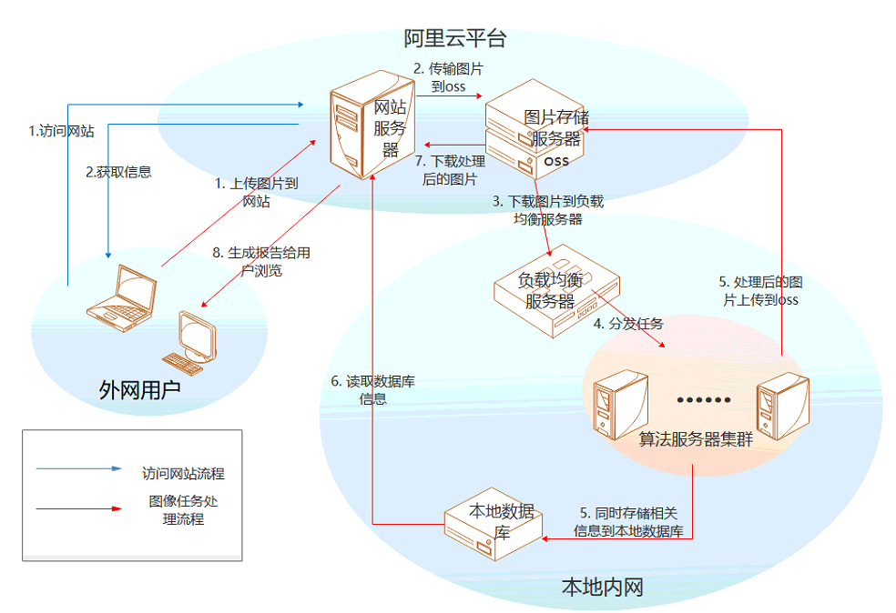

# Eyecloud Algorithms Backend
## algorithm
图像处理算法块，基于深度学习的模型，具体代码不做上传
## config
各类信息的json文件，用于直接调用
## data_access
数据库的操作方式
## routes
路由的信息，分为提交任务与查询
## services
一些服务模块，比如加密解密，字段验证等
## tasks
任务模块，执行调用算法模型生成dict数据或者报告 以及 celery的任务队列服务
## template
报告模板，生成报告时调用
## other
nginx配置 数据库服务器等

